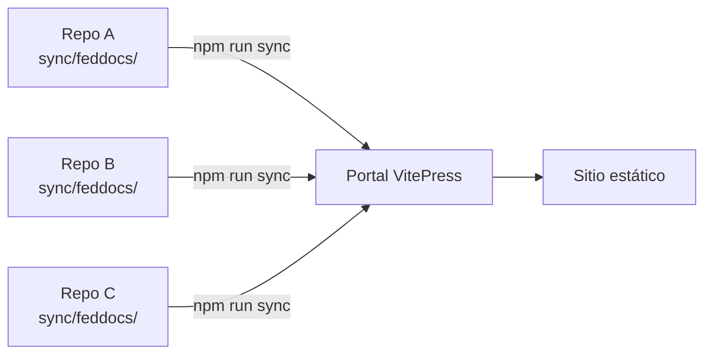

<p align="center">
  
  
  
  
</p>

# 📚 FedDocs — Federated Documentation Portal

> Portal centralizado de documentación técnica que sincroniza automáticamente desde múltiples repositorios, organizado por equipos y proyectos.

---

## ✨ Features

- 🔄 **Sincronización automática** — Clona y sincroniza docs desde múltiples repos con un solo comando
- 📋 **Contrato de federación** — Estructura estandarizada que garantiza calidad y consistencia
- 🏷️ **Badges automáticos** — Ownership, lifecycle y metadata inyectados en cada página
- 🧭 **Navegación por equipo** — Sidebar auto-generado agrupado por equipo → proyecto → vistas
- 📊 **Diagramas Mermaid** — Soporte nativo para diagramas técnicos
- 🔒 **Builds reproducibles** — Lock file para despliegues determinísticos
- 🤖 **AI-Ready** — Contrato específico para agentes IA + prompt listo para usar
- ⚡ **Sparse checkout** — Solo descarga la carpeta de docs, no el repo completo

---

## 🏗️ Architecture

```
feddocs/
├── docs/                          # Contenido del portal
│   ├── .vitepress/config.mts      # Configuración VitePress
│   ├── guide/                     # Guía estática del portal
│   │   ├── index.md               # Introducción
│   │   ├── setup.md               # Setup del portal
│   │   ├── contract.md            # Contrato de federación (humanos)
│   │   ├── contract-agents.md     # Contrato para AI Agents
│   │   ├── prompt.md              # Prompt listo para nuevos federados
│   │   ├── add-source.md          # Cómo agregar un source
│   │   └── sync-script.md         # Referencia técnica del sync
│   ├── index.md                   # Home page
│   └── <team>/<project>/          # ← Generado por sync
├── scripts/
│   └── sync-docs.js               # Script de sincronización
├── docs.sources.json              # Configuración de sources
├── docs.lock.json                 # Lock file (generado)
└── package.json
```

---

## 🚀 Quick Start

```sh
# 1. Clonar el portal
git clone https://github.com/cmontesvergara/feddocs.git
cd feddocs

# 2. Instalar dependencias
npm install

# 3. Sincronizar docs + levantar dev server
npm run dev
```

El portal estará disponible en `http://localhost:5173`.

---

## 📦 Commands

| Comando | Qué hace |
|---|---|
| `npm run sync` | Sincroniza documentación desde todos los sources |
| `npm run dev` | Sync + dev server con hot reload |
| `npm run build` | Build de producción (usa lock file) |
| `npm run preview` | Preview del build de producción |

---

## 🔄 Cómo funciona



1. Cada repositorio mantiene su documentación en `sync/feddocs/` siguiendo el [contrato de federación](docs/guide/contract.md)
2. `sync-docs.js` clona los repos (sparse checkout), valida el contrato y copia los archivos
3. `docs.lock.json` registra el commit de cada source para cache y builds reproducibles
4. VitePress genera un sitio estático con navegación automática

---

## 📝 Federar tu proyecto

¿Querés integrar la documentación de tu proyecto al portal? Dos opciones:

### Opción A: Con AI Agent (recomendado)

1. Abrí la [página del prompt](docs/guide/prompt.md) en el portal
2. Copiá el prompt, completá los datos de tu proyecto
3. Pegalo en tu agente IA (Cursor, Copilot, Gemini, etc.)
4. Revisá, commit y push

### Opción B: Manual

1. Leé el [contrato de federación](docs/guide/contract.md)
2. Creá `sync/feddocs/` con los 6 archivos requeridos
3. Commit y push
4. Agregá tu repo a `docs.sources.json`

---

## ⚙️ Agregar un source al portal

Editá `docs.sources.json`:

```json
{
    "mi-servicio": {
        "repo": "https://github.com/tu-org/mi-servicio.git",
        "ref": "main",
        "path": "sync/feddocs",
        "label": "Mi Servicio"
    }
}
```

Ejecutá `npm run sync` y listo.

---

## 📖 Guía completa

La documentación del portal incluye:

| Página | Descripción |
|---|---|
| [Introducción](docs/guide/index.md) | Visión general del sistema |
| [Setup](docs/guide/setup.md) | Cómo instalar y configurar el portal |
| [Contrato](docs/guide/contract.md) | Reglas para federar un repositorio |
| [Contrato AI](docs/guide/contract-agents.md) | Versión detallada para agentes IA |
| [Prompt](docs/guide/prompt.md) | Prompt copy-paste para nuevos federados |
| [Agregar Source](docs/guide/add-source.md) | Paso a paso para integrar un repo |
| [Sync Script](docs/guide/sync-script.md) | Referencia técnica del script |

---

## 🛠️ Stack

- **[VitePress](https://vitepress.dev)** — Generador de sitios estáticos
- **[Mermaid](https://mermaid.js.org)** — Diagramas en markdown
- **[Node.js](https://nodejs.org)** — Runtime del sync script
- **Git sparse checkout** — Descarga eficiente de repos

---

## 📄 License

[MIT](LICENSE)
