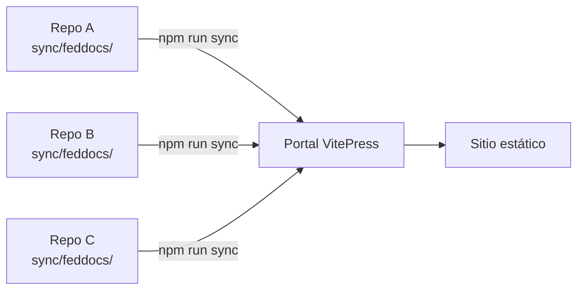

# Guía del Portal de Documentación Federada

Bienvenido a la guía de implementación del portal de documentación federada.
Este sitio agrega documentación técnica desde múltiples repositorios, organizándola
por **equipos** y **proyectos** bajo una estructura estándar.

## ¿Cómo funciona?



1. Cada repositorio mantiene su documentación en `sync/feddocs/` siguiendo un [contrato estandarizado](./contract)
2. Un script de sincronización (`sync-docs.js`) clona los repos, valida el contrato y copia los archivos
3. Un `docs.lock.json` registra el commit de cada source para cache y builds reproducibles
4. VitePress genera un sitio estático con navegación automática por equipo → proyecto → vistas

## Estructura del Portal

```
docs-portal/
├── docs/
│   ├── guide/                    ← Esta guía (estática, no federada)
│   ├── <equipo>/                 ← Auto-generado por sync
│   │   └── <proyecto>/
│   │       ├── index.md          ← Overview con metadata
│   │       ├── onboarding.md     ← Setup y primeros pasos
│   │       ├── architecture.md   ← Diagrama y decisiones
│   │       ├── integration.md    ← APIs y consumo
│   │       ├── operations.md     ← Deploy y monitoreo
│   │       └── references.md     ← Links y recursos
│   ├── index.md                  ← Home page
│   └── .generated-sidebar.json   ← Sidebar auto-generado
├── docs.sources.json             ← Repos a sincronizar
├── docs.lock.json                ← Commits sincronizados (auto-generado)
└── scripts/
    └── sync-docs.js              ← Motor de sincronización
```

## Índice de la Guía

| Sección | Descripción |
|---|---|
| [Setup del Portal](./setup) | Cómo instalar y configurar el portal desde cero |
| [Contrato de Federación](./contract) | Reglas que cada repositorio debe cumplir |
| [Agregar un Source](./add-source) | Paso a paso para federar un nuevo repositorio |
| [Sync Script](./sync-script) | Cómo funciona el motor de sincronización |
