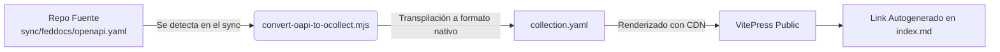

# Explorador de API (Playground)

El portal de FedDocs incluye soporte automatizado para generar un **Playground interactivo** en cada repositorio que exponga una API. Si tu proyecto maneja endpoints, puedes aprovechar esta funcionalidad sin esfuerzo adicional.

---

## ¿Cómo funciona?

El motor de sincronización (`sync-docs.js`) está diseñado para detectar especificaciones de API de manera nativa y convertirlas en un entorno visual interactivo dentro de tu documentación. 

El flujo de procesamiento es el siguiente:

1. **Detección:** Durante `npm run sync`, el script verifica si tu directorio `sync/feddocs/` incluye un archivo llamado rigurosamente `openapi.yaml`.
2. **Transformación:** Toma tu documento estándar OpenAPI 3.x y lo convierte automáticamente al formato [OpenCollection](https://www.opencollection.com), un estándar moderno diseñado nativamente para playgrounds y clientes HTTP en la web.
3. **Generación HTML:** Se genera un archivo de entrada con el componente web `<open-collection>` que procesa la colección dinámicamente.
4. **Vinculación:** La pantalla de inicio de tu proyecto en el portal (`index.md`) recibirá automáticamente un botón/link llamado `[Explorar API (Playground)]` que abre la interfaz visual en una nueva pestaña.

---

## Archivo `openapi.yaml`

El único requisito por parte de tu repositorio es incluir este archivo. 

### Reglas básicas:
- **Ubicación:** DEBE llamarse `openapi.yaml` y vivir obligatoriamente en la raíz de `sync/feddocs/`.
- **Formato:** OpenAPI versión 3.x puro.
- **Autocontenido:** NO uses `$ref` que apunten a rutas protegidas de tu computadora personal o URLs externas con autenticación, ya que el motor de sincronizado fallará al intentar descargar las referencias. Todo el esquema debe ser consumible.
- **Soporte IA:** Si usas Agentes IA en tu ciclo de vida, puedes instruirles usar contratos existentes (como `swagger.json`) para ensamblar automáticamente tu `openapi.yaml` actualizado al empujar código.

---

## El Resultado

Cuando un desarrollador ingresa a la vista inicial de tu proyecto en el portal, notará el acceso director al Playground. 

A través del Playground generado, los dev consumers podrán:
- Autenticarse de forma independiente en sus navegadores.
- Explorar los esquemas de petición (Request) y las diferentes respuestas de estado HTTP (Response).
- Cambiar entornos (si defines tu matriz de `servers` en el yaml).
- **Ejecutar las peticiones reales** desde el navegador y ver la transacción sin la necesidad de usar Postman o ThunderClient en sus propios escritorios.
