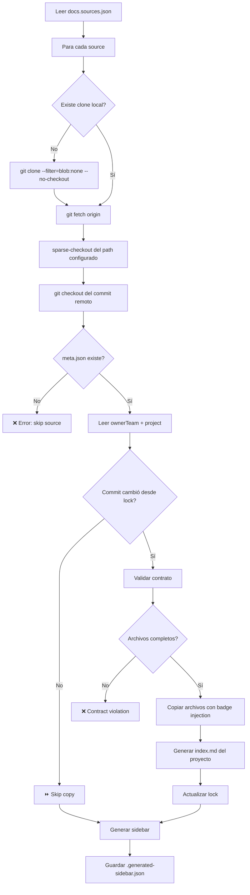

# Sync Script — Referencia Técnica

El archivo `scripts/sync-docs.js` es el motor del portal. Se encarga de clonar repositorios,
validar el contrato, copiar archivos, inyectar badges y generar el sidebar.

## Ejecución

```sh
# Sync normal
npm run sync

# Sync con lock (reproducible)
DOCS_LOCK=true npm run sync
```

---

## Flujo de ejecución



---

## Archivos de entrada

### `docs.sources.json`

Lista de repositorios a sincronizar:

```json
{
    "sso-core": {
        "repo": "https://github.com/tu-org/sso-core.git",
        "ref": "main",
        "path": "sync/feddocs",
        "label": "SSO Core"
    }
}
```

### `docs.lock.json` (auto-generado)

Registra el último commit sincronizado por source:

```json
{
    "sso-core": {
        "commit": "3cb6f87683d809e74ec39870fc76846283fba06c",
        "ref": "main",
        "path": "sync/feddocs",
        "syncedAt": "2026-02-14T17:10:00.000Z"
    }
}
```

::: tip Variable DOCS_LOCK
Con `DOCS_LOCK=true`, el sync usa los commits del lock file en lugar de los más recientes.
Esto garantiza builds reproducibles.
:::

---

## Archivos de salida

### Estructura por equipo/proyecto

```
docs/<ownerTeam>/<project>/
├── index.md          ← Auto-generado: overview + metadata + tabla de vistas
├── onboarding.md     ← Copiado del source con badge inyectado
├── architecture.md
├── integration.md
├── operations.md
├── references.md
└── openapi.yaml      ← Opcional: Generado de Playground (OpenCollection)
```

### `.generated-sidebar.json`

Sidebar dinámico que VitePress consume:

```json
{
  "/sso-team/sso-core/": [
    {
      "text": "sso-team",
      "items": [
        {
          "text": "sso-core",
          "collapsed": false,
          "items": [
            { "text": "Overview", "link": "/sso-team/sso-core/" },
            { "text": "Onboarding", "link": "/sso-team/sso-core/onboarding" },
            { "text": "Architecture", "link": "/sso-team/sso-core/architecture" },
            { "text": "Integration", "link": "/sso-team/sso-core/integration" },
            { "text": "Operations", "link": "/sso-team/sso-core/operations" },
            { "text": "References", "link": "/sso-team/sso-core/references" }
          ]
        }
      ]
    }
  ]
}
```

---

## Funciones principales

### `validateContract(srcDir)`

Verifica que todos los archivos obligatorios existan:

```javascript
const REQUIRED_FILES = [
  'onboarding.md',
  'architecture.md',
  'integration.md',
  'operations.md',
  'references.md',
  'meta.json'
]
```

Si falta alguno, retorna `{ valid: false, missing: [...] }` y el source se omite.

### `generateBadge(meta)`

Crea un bloque `::: info` con metadata de `meta.json`:

```
::: info Metadata
**Owner:** sso-team · **Lifecycle:** active · **Last Reviewed:** 2026-02-13 · **Support:** #sso-core
:::
```

### `injectBadge(srcFile, destFile, badge)`

Copia un archivo markdown e inyecta el badge:
- Si tiene frontmatter (`---`), lo inserta **después** del frontmatter
- Si no tiene frontmatter, lo inserta al inicio

### `generateProjectIndex(meta, teamSlug, projectSlug)`

Genera `index.md` con:
- Título del proyecto
- Descripción (blockquote desde `meta.description`)
- Badge de metadata
- Tabla de vistas con links

### `slugify(str)`

Convierte nombres de equipo a slugs para URLs:
- `"sso-team"` → `"sso-team"`
- `"Payments Team"` → `"payments-team"`

---

## Git Sparse Checkout

El script usa **sparse checkout** para descargar solo la carpeta de docs, no el repositorio completo:

```sh
# Clone sin contenido (solo metadata)
git clone --filter=blob:none --no-checkout <repo> <dir>

# Configurar sparse checkout
git sparse-checkout init --no-cone
git sparse-checkout set "sync/feddocs/**"

# Descargar solo esa carpeta
git checkout <commit>
```

Esto es crítico para repositorios grandes — solo descarga los bytes necesarios.

---

## Cache y Performance

El script implementa un mecanismo de cache basado en commits:

1. Después de cada sync exitoso, graba el commit en `docs.lock.json`
2. En la siguiente ejecución, compara el commit actual con el del lock
3. Si no cambió, omite la copia (pero sigue generando la sidebar)

```
⏩ sso-core unchanged (3cb6f87), skipping copy
```

Para forzar una re-sincronización completa:

```sh
rm docs.lock.json
npm run sync
```

---

## Manejo de errores

| Error | Comportamiento |
|---|---|
| Repo no accesible | Reporta error, continúa con el siguiente source |
| Path no existe en repo | Reporta error, continúa |
| `meta.json` no encontrado | Reporta error, continúa |
| Archivos obligatorios faltantes | Reporta `Contract violation`, continúa |
| Cualquier excepción | Captura, reporta, continúa |

Al final del sync, muestra un resumen de errores:

```
⚠️  Some sources had issues:
   • broken-repo: Connection refused
   • incomplete-docs: Contract violation: missing architecture.md
```

Ningún error bloquea la sincronización de los demás sources.
